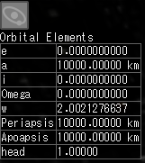
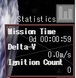
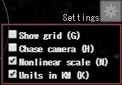

# WebGL-Orbiter

An orbit simulator for the solar system in real scale with Newtonian dynamics,
which can be manipulated like amazing game Kerbal Space Program.

Try it now on your browser!

http://msakuta.github.io/WebGL-Orbiter/orbiter.html

## Screenshots

## Controls

* '+' key increases simulation speed of time
* '-' key decreases simulation speed of time
* 'W' key rotates the vehicle upward
* 'S' key rotates the vehicle downward
* 'A' key rotates the vehicle left
* 'D' key rotates the vehicle right
* 'Q' key rotates the vehicle counterclockwise
* 'E' key rotates the vehicle clockwise
* 'Z' key sets the throttle to maximum
* 'X' key sets the throttle to zero (halts the engine)
* Shift key gradually increases throttle
* Ctrl key gradually decreases throttle
* 'H' key toggles camera chase mode
* 'G' key toggles grids

## User Interface

### Simulation Speed Control

On top left corner of the screen is a widget for controlling the speed of the simulation, from real-time to a million times faster than reality.

Clicking on one of the green triangles sets the speed to that scale.
Leftmost is slowest and it gets faster as you go right.
Each triangle means 10 times faster than the previous one.
You can also change the speed by '+' and '-' keys.

Note that you cannot turn or accelerate the vehicle unless you're in real-time scale.

You'll need it to travel distances between planets.

### Orbital Elements

Just below the Speed control is a little icon for toggling orbital elements display.

If you click on it,  a little table shows up like below.

These are parameters that uniquely define the orbit, given an orbital plane as a reference frame.
In this application, reference frame is ecliptic plane.
If you're not familiar with orbital mechanics, [Wikipedia](https://en.wikipedia.org/wiki/Orbital_elements) is a good place to start learning.

* e - Eccentricity.
* a - Semi-major axis.
* i - Inclination.
* Omega - Longitude of Ascending Node.
* w - Longitude of Periapsis.
* Periapsis - The distance of Periapsis from the center of celestial body.
* Apoapsis - The distance of Apoapsis from the center of celestial body.
* head - Whether the vehicle is heading towards apoapsis. This is not really an orbital element, mainly used for debugging.

### Statistics

On the right top corner is an icon for statistics.

Clicking on it will toggle the display of statistics of the whole mission.

* Mission time

  Quite obvious, but it's the (in-simulation) elapsed time since the simulation has started.

* Delta-V

  The total Delta-V exerted by burning the rocket engine. Basically all rockets have limited Delta-V, which is determined by amount of fuel and weight of the rocket, among other factors.
  However, in this simulation, our rocket has infinite Delta-V.

* Ignition Count

  If you throttle up from zero, it's counted as an ignition. The number of ignition matters because re-igniting liquid fuel engine in zero-g is not a trivial work.

### Settings

Just below the Statistics icon is an icon for toggling setting display.

Clicking on it will toggle the display of a panel for settings.
Characters in parentheses indicate shortcut keys.

* Show grid - Toggles display of a grid in space.
* Chase camera - If it's turned on, the camera will automatically face the directon of vehicle's acceleration.
* Nonlinear scale - Renders objects in a fake scale so that they appear even if they would be smaller than a pixel in real scale. Don't worry - the simulation will always be performed in real scale.
* Units in KM - Shows distances in Orbital Elements panel in Kilometers instead of AUs.

## Sources

* orbiter.html

  The real-time orbital simulator with three.js and WebGL.
  You'll need a WebGL supporting browser in order to enable this simulation.

* runge-kutta.html  

  Formulation of methods used for simulation steps.  Euler method and Runge-Kutta method
  are presented.  You'll need a decent browser with JavaScript support to see the formula.

## Libraries

This project uses three.js JavaScript library for rendering.
